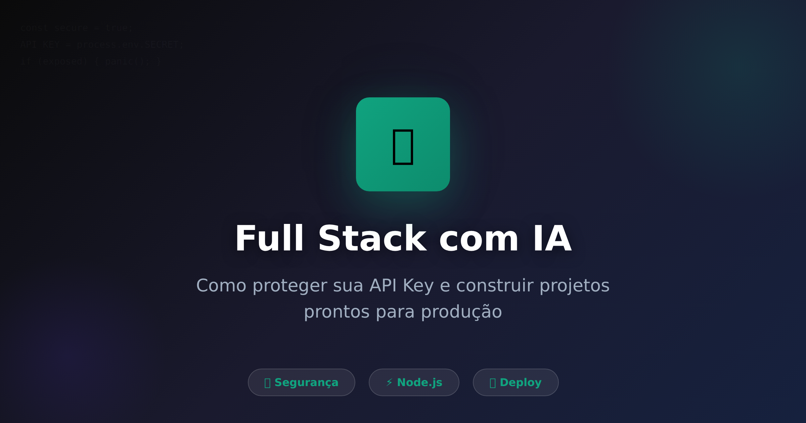
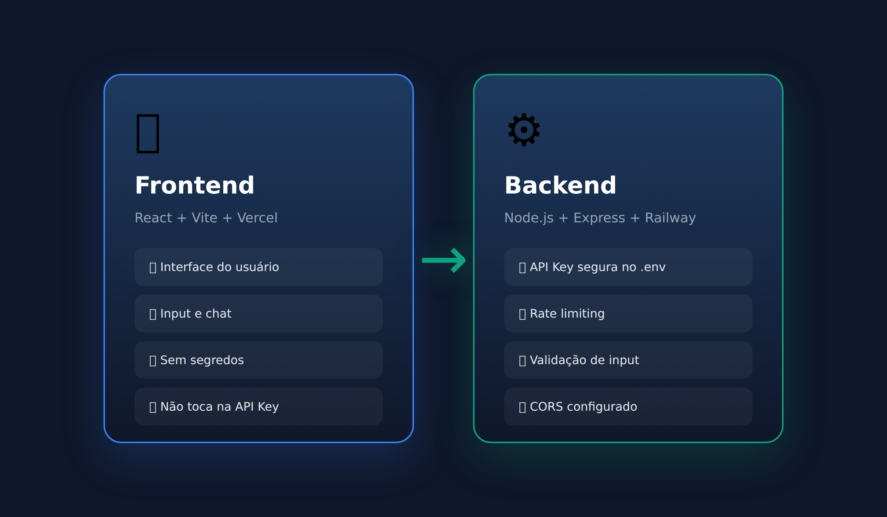
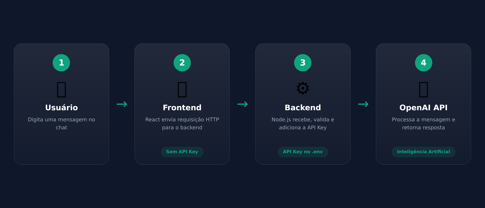
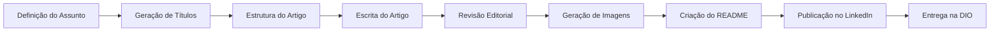

<div align="center">

<!-- Banner -->


<br>

<!-- Badges -->
[](https://www.dio.me/)
[](https://github.com/matheusflorindo32/dio-artigo-ia-fullstack-seguro)
[](https://github.com/matheusflorindo32/dio-artigo-ia-fullstack-seguro)
[](https://medium.com)
[](https://linkedin.com)

<br>

<!-- Tagline -->
<p align="center">
  <b>🚀 Artigo técnico completo sobre segurança em aplicações Full Stack com IA</b><br>
  <i>Arquitetura segura • Variáveis de ambiente • Rate Limiting • Deploy Profissional</i>
</p>

</div>

---

## 📋 Sobre o Projeto

<table>
<tr>
<td width="60%">

### O que é este projeto?

Este repositório contém um **artigo técnico completo** desenvolvido como desafio da DIO, com o tema:

> **"Como criar aplicações Full Stack com IA sem expor sua API Key no Frontend"**

O artigo aborda de forma didática e prática como construir aplicações seguras com inteligência artificial, protegendo credenciais sensíveis e implementando boas práticas de desenvolvimento.

</td>
<td width="40%">

### 📊 Resumo do Projeto

| Item | Descrição |
|------|-----------|
| **Tema** | Segurança em aplicações Full Stack com IA |
| **Formato** | Artigo técnico + repositório organizado |
| **Público** | Iniciantes e intermediários em web |
| **Foco** | Portfólio profissional e boas práticas |
| **Status** | ✅ Concluído e publicado |

</td>
</tr>
</table>

---

## 🎯 Objetivo

Criar um artigo técnico que ensine desenvolvedores a:

1. ✅ Entender o **risco de expor API Keys** no frontend
2. ✅ Arquiteturar aplicações **Full Stack seguras** com IA
3. ✅ Usar **variáveis de ambiente** corretamente
4. ✅ Implementar **rate limiting** básico
5. ✅ Fazer **deploy profissional** (Railway + Vercel)
6. ✅ Transformar projetos em **portfólio de qualidade**

---

## 📝 Artigo Publicado

📄 **Leia o artigo completo:** [LINK_DO_ARTIGO]

O artigo foi escrito com:
- Linguagem clara e profissional
- Exemplos de código reais
- Diagramas e fluxogramas
- Alertas de segurança
- Checklist de implementação
- Call to action para portfólio

---

## 🖼️ Preview Visual

| Capa do Artigo | Arquitetura Segura | Deploy |
|:---:|:---:|:---:|
|  |  |  |

> 💡 **Nota:** As imagens acima são representações. Veja a pasta `/images` para os arquivos completos.

---

## 📁 Estrutura do Repositório

```
dio-artigo-ia-fullstack-seguro/
│
├── README.md                          # ← Você está aqui
│
├── article/
│   └── artigo-fullstack-ia-api-key.md   # Artigo completo em Markdown
│
├── prompts/
│   ├── 01_prompt_definicao_assunto.md
│   ├── 02_prompt_titulos_headline.md
│   ├── 03_prompt_estrutura_artigo.md
│   ├── 04_prompt_artigo_completo.md
│   ├── 05_prompt_imagem_capa.md
│   ├── 06_prompt_imagens_apoio.md
│   ├── 07_prompt_revisao_editorial.md
│   ├── 08_prompt_readme_premium.md
│   └── 09_prompt_publicacao_linkedin.md
│
├── images/
│   ├── capa-artigo.png
│   ├── frontend-backend.png
│   ├── api-key-segura.png
│   ├── fluxo-seguro-ia.png
│   └── github-portfolio.png
│
└── docs/
    └── checklist-entrega-dio.md
```

### Descrição das pastas

| Pasta | Conteúdo |
|-------|----------|
| `/article` | Artigo técnico completo, pronto para publicação |
| `/prompts` | Todos os prompts utilizados na criação do projeto |
| `/images` | Imagens geradas para o artigo e README |
| `/docs` | Documentação auxiliar e checklists |

---

## 🛠️ Prompts Utilizados

Este projeto foi construído com auxílio de IA, utilizando prompts profissionais e bem estruturados.

| Arquivo | Finalidade |
|---------|------------|
| `01_prompt_definicao_assunto.md` | Definição clara do tema e público-alvo |
| `02_prompt_titulos_headline.md` | Geração de títulos impactantes |
| `03_prompt_estrutura_artigo.md` | Organização da estrutura do artigo |
| `04_prompt_artigo_completo.md` | Escrita do artigo completo |
| `05_prompt_imagem_capa.md` | Prompt para imagem de capa |
| `06_prompt_imagens_apoio.md` | Prompts para imagens de apoio |
| `07_prompt_revisao_editorial.md` | Revisão e ajustes do artigo |
| `08_prompt_readme_premium.md` | Criação deste README |
| `09_prompt_publicacao_linkedin.md` | Texto para divulgação no LinkedIn |

---

## 🎨 Imagens Geradas

| Imagem | Descrição | Arquivo |
|--------|-----------|---------|
| Capa | Proteção de API Key em aplicações web | `capa-artigo.png` |
| Arquitetura | Frontend vs Backend separados | `frontend-backend.png` |
| Segurança | Chave protegida por cadeado digital | `api-key-segura.png` |
| Fluxo | Fluxo seguro usuário → frontend → backend → IA | `fluxo-seguro-ia.png` |
| Portfolio | GitHub com README profissional | `github-portfolio.png` |

---

## 🧠 Processo de Criação



---

## 💡 Aprendizados

Durante este projeto, aprofundei conhecimentos em:

- 🏗️ **Arquitetura Full Stack** — Separação frontend/backend
- 🔐 **Segurança de APIs** — Proteção de credenciais sensíveis
- 📝 **Engenharia de Prompts** — Comunicação eficiente com IA
- 🎨 **Design Editorial** — READMEs e apresentações visuais
- 📢 **Marketing Pessoal** — Divulgação técnica no LinkedIn
- 🚀 **Deploy Profissional** — Railway, Vercel, variáveis de ambiente

---

## ✅ Checklist de Entrega DIO

- [x] Criar repositório no GitHub
- [x] Criar pastas organizadas (/article, /prompts, /images, /docs)
- [x] Salvar todos os prompts utilizados
- [x] Salvar imagens geradas
- [x] Escrever artigo completo
- [x] Criar README.md profissional
- [x] Inserir link do artigo no README
- [x] Conferir se as imagens carregam no GitHub
- [x] Conferir se os links estão corretos
- [x] Enviar link do repositório na plataforma da DIO

---

## 🔗 Links

| Recurso | Link |
|---------|------|
| 📄 Artigo | [LINK_DO_ARTIGO] |
| 📁 Repositório | [LINK_DO_REPOSITORIO] |
| 💼 LinkedIn | [LINK_DO_LINKEDIN] |
| 🚀 Deploy | [LINK_DO_DEPLOY] |
| 🎯 Desafio DIO | [LINK_DO_DESAFIO] |

---

## 👨‍💻 Autor

<table>
<tr>
<td align="center">


**Matheus Florindo**

Desenvolvedor em formação | Projetos com IA | Full Stack | Portfólio DIO

[](https://github.com/matheusflorindo32)
[](https://linkedin.com/in/matheus-florindo)
[](https://www.dio.me/users/matheusflorindo32)

</td>
</tr>
</table>

---

## 🙏 Referências

- 🎓 **Digital Innovation One (DIO)** — Desafio prático e plataforma de educação
- 📚 **Repositório de referência** — [felipeAguiarCode/prompts-for-article-generate-by-ia](https://github.com/felipeAguiarCode/prompts-for-article-generate-by-ia)
- 🤖 **OpenAI** — API de Inteligência Artificial
- 🛠️ **Railway** — Plataforma de deploy para backend
- 🌐 **Vercel** — Plataforma de deploy para frontend

---

<div align="center">


<br>

⭐ **Se este projeto te ajudou, deixe uma star no repositório!** ⭐

</div>
